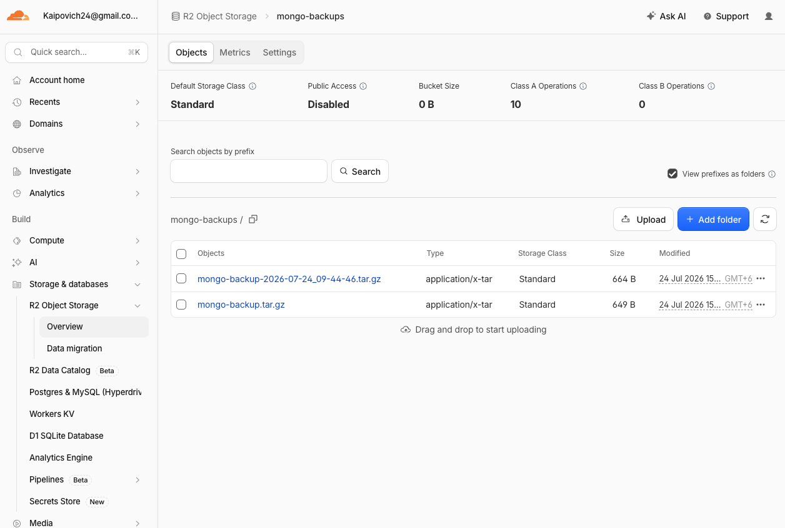

# MongoDB Backup to Cloudflare R2

This project backs up a MongoDB database running in Docker on an existing AWS EC2 server. The backup is compressed into a tarball, uploaded to Cloudflare R2, and executed every 12 hours using cron.

## Setup

1. Created the `mongo-backups` R2 bucket.
2. Created an Account API token with **Object Read & Write** access limited to this bucket.
3. Installed AWS CLI:

```bash
sudo apt install -y awscli
```

4. Configured a separate R2 profile:

```bash
aws configure --profile r2
```

The region was set to `auto`.

## Backup Script

The `backup.sh` script:

* Runs `mongodump` inside `todo-api-mongodb`.
* Copies the dump from the container to EC2.
* Creates a timestamped `.tar.gz` archive.
* Uploads it to the `mongo-backups` R2 bucket.
* Removes temporary backup files.

Make it executable and test it:

```bash
chmod +x backup.sh
```

```bash
./backup.sh
```

## Scheduled Backup

The script was copied to:

```text
/opt/mongodb-backup/backup.sh
```

A cron job runs it every 12 hours:

```cron
0 */12 * * * /opt/mongodb-backup/backup.sh >> /opt/mongodb-backup/backup.log 2>&1
```

Verify the schedule:

```bash
crontab -l
```

Check the logs:

```bash
cat /opt/mongodb-backup/backup.log
```

## Result

MongoDB is backed up at `00:00` and `12:00` according to the EC2 server timezone. Each backup has a timestamped filename and is stored remotely in Cloudflare R2.

