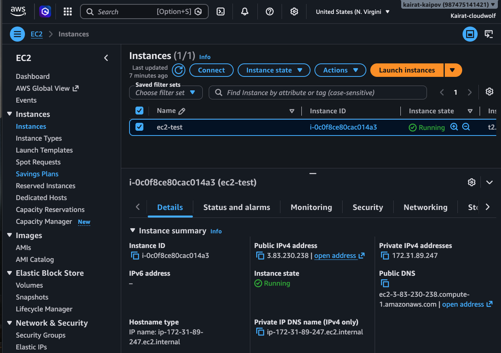
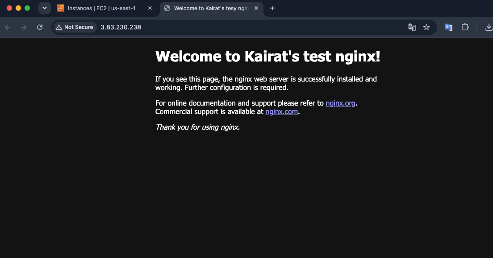

# AWS EC2 Static Website

In this project, I launched an Ubuntu EC2 instance on AWS and configured its security group to allow SSH on port `22` and HTTP on port `80`.

I connected to the instance using an SSH private key:

```bash
ssh -i ~/Downloads/ssh-test.pem root@3.83.230.238
```

I then updated the server, installed Nginx, and deployed a simple static HTML website.

The website was successfully accessible through the EC2 instance’s public IP address(http, not https).





