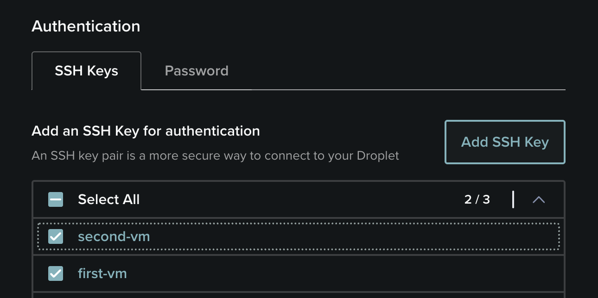
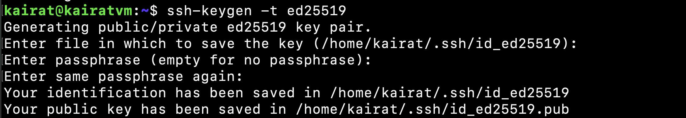
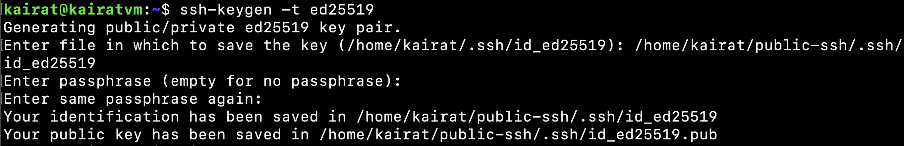
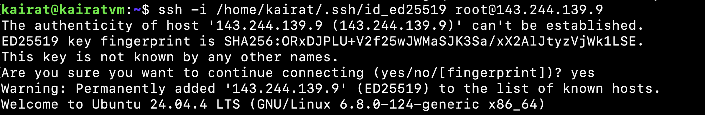
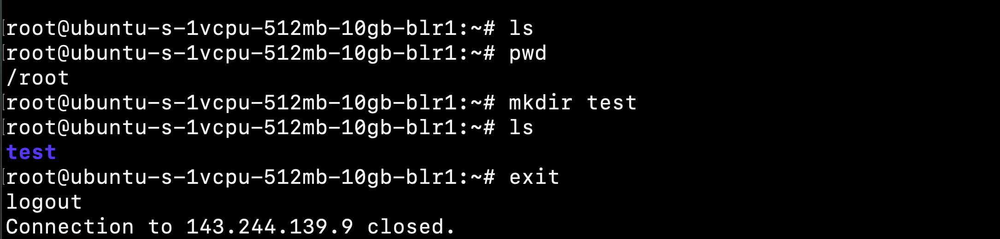
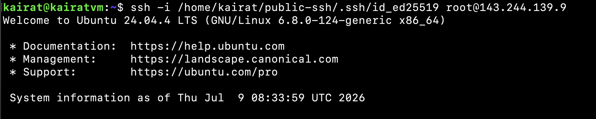
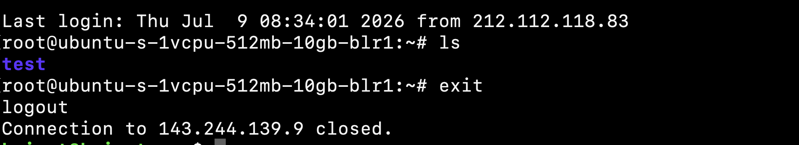
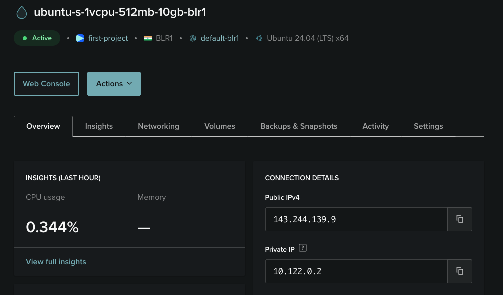

# Linux Server SSH Setup

In this project, I created a remote Linux server using a DigitalOcean Droplet and configured SSH access.

I created two separate SSH key pairs and added both public keys during the Droplet setup.



The first key was created at:

```bash
/home/kairat/.ssh/id_ed25519
```



The second key was created in another folder:

```bash
/home/kairat/public-ssh/.ssh/id_ed25519
```



After the server was created, I tested the connection with both private keys.









Both SSH keys worked successfully.

